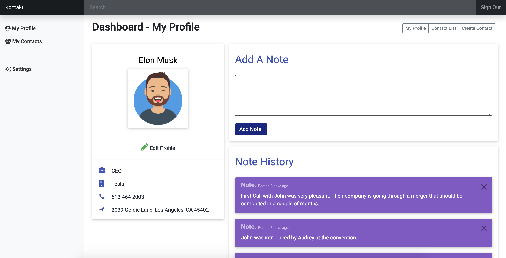
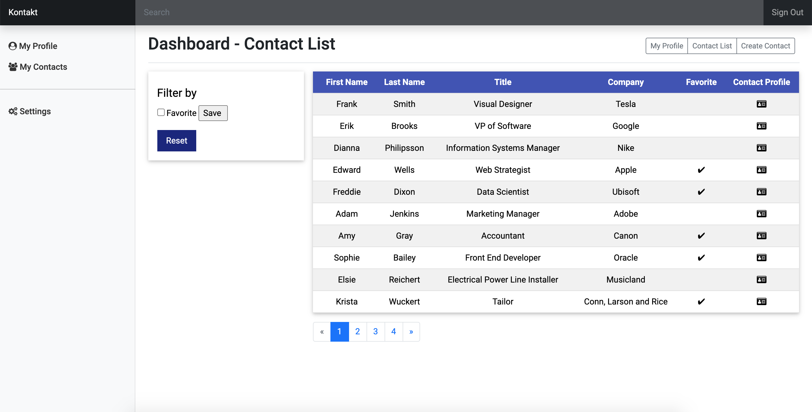
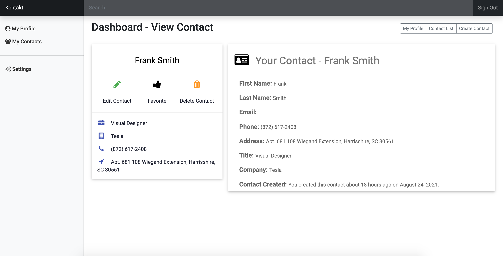
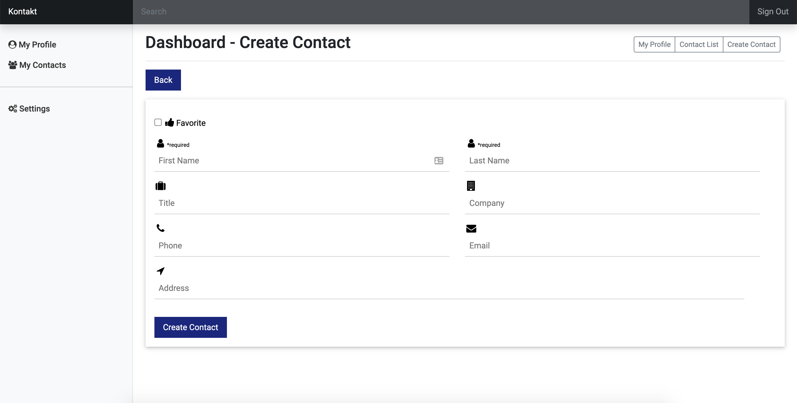

# README

# Project Summary

Kontakt is a contact management web application that allows you to keep track of your contacts.

Live Link : [https://kontakt-manager.herokuapp.com/](https://kontakt-manager.herokuapp.com/)

## Table of contents

- [General info](#general-info)
- [Screenshots](#screenshots)
- [Technologies](#technologies)
- [Setup](#setup)
- [Test](#test)
- [Features](#features)
- [Status](#status)
- [Contact](#contact)

## General info

I had previously designed this application as a single page application with angular.js. I wanted to see what it will be
like built on Ruby on Rails.

The angular.js version made use of routing and was fast to navigate. However, changes were not saved permanently because
there was no database

**Angular.js Version Screenflow**

## Screenshots

**Kontakt Profile Page**

**Contact List View**

**Contact View**

**Create New Contact**

## Technologies

- Ruby 3.0.0
- Ruby on Rails 6
- Bootstrap
- W3.CSS
- jQuery

## Setup

After downloading the Git repository, follow the steps below to setup the application locally.

1. Run `rails bundle`
2. Run `npm install`
3. See further instructions below for the database
4. To create the database, run `rails db:create`
5. Migrate the migration files with `rails db:migrate`
6. Seed the database with some data with `rails db:seed`

### Database

I used MYSQL for the database.

In config/database.yml, you will want to change the username and password to your local credentials.

Alternatively, you can change the database by running either of the commands below depending of your local database
system and installing the proper gems in the gemfile.

1. `rails db:system:change --to=postgresql`
2. `rails db:system:change --to=sqlite3`

## Test

To run controller tests, model tests and integration tests, you can run `rails test`

To run system tests, run `rails test:system`

## Key Features

- A user can create an account

- A user can add notes to his profile

- A user can add contacts, edit contacts and delete contacts

- A user can search through his list of contacts

### To-do list:

- Add sort feature to contact list

## Status

Project is: _finished_, but further features could be added again.

## Contact

Created by Krishna Diamesso. You can contact me at krishnadiamesso@gmail.com
